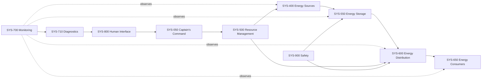

# SC-200-001 System Architecture Specification

## Architectural intent

The architecture separates physical resource flow, information collection, health assessment, supervisory decisions, safety protection, and captain interaction. Systems own functions; products are selected later.

## Vehicle platform allocation

SYS-100 is implemented by the **Renault Master E-Tech electric L2H2 panel van, 87 kWh Long Range, 3.5 t permissible gross mass**. Current official Renault Switzerland configuration data lists 5681 mm overall length, 2500 mm height, 3225 mm maximum load-floor length, 1885 mm interior height, 10.8 m³ load volume, and an average payload range of 844–1132 kg depending on configuration. These are supplier configuration inputs, not as-built acceptance values.

The exact ordered vehicle specification, unladen/running-order mass, axle limits, tyre ratings, governed speed, homologation data, and conversion constraints require confirmation from the vehicle Certificate of Conformity, quotation, body-builder documentation, and registration authority before design freeze. See [ADR-003](../40-decisions/ADR-003-renault-master-etech-l2h2-platform.md).

## Top-level systems

| ID | System | Responsibility |
|---|---|---|
| SYS-050 | Captain's Command | Final operating authority, modes, overrides, acknowledgements, and diagnostic initiation within safety limits |
| SYS-100 | Vehicle Platform and Mobility | Driving, parking, payload, vehicle interfaces, and approved traction-energy availability |
| SYS-200 | Habitation | Beds, furniture, living space, storage, and local ergonomics |
| SYS-300 | Water and Sanitary | Fresh water, grey water, pump, toilet, outside shower, drainage, and winterization |
| SYS-400 | Energy Sources | Solar, approved vehicle/traction interface, and commanded shore input |
| SYS-500 | Resource Management | Energy policy, source priorities, reserve, autonomy estimation, and surplus-resource allocation |
| SYS-550 | Energy Storage | 48 V house battery, BMS, thermal monitoring, protection, and isolation |
| SYS-600 | Energy Distribution | 48 V backbone, derived 12 V service bus, 230 V AC domain, conversion, protection, and switching |
| SYS-650 | Energy Consumers | Lighting, refrigeration, pumps, ventilation, user power, and future high-power loads |
| SYS-700 | Monitoring and Information | Data acquisition, display, alarms, logging, and export |
| SYS-710 | Built-In Test and Diagnostics | Power-on test, continuous health monitoring, manual checks, isolation, and guided troubleshooting |
| SYS-800 | Human Interface | Displays, controls, master commands, manual overrides, and service interaction |
| SYS-900 | Safety | Fire, electrical isolation, emergency shutdown, gas-cartridge safety, and protection of people |
| SYS-1000 | Maintenance and Serviceability | Access, labels, test points, replaceability, service procedures, and tools |
| SYS-1100 | Digital Twin and Documentation | Requirements, models, diagrams, configuration, evidence, and living manual |
| SYS-1200 | Configuration and Lifecycle | Installed configuration, versions, calibration, maintenance history, changes, and obsolescence management |

## Level-0 functional flow

## Accepted electrical architecture

- 48 V DC is the house backbone.
- 12 V DC is a derived service bus for standard camper loads.
- A 24 V bus is excluded unless a future requirement and trade study justify it.
- 230 V AC is a separately protected domain supplied by inverter or shore interface.
- The vehicle high-voltage system remains vehicle-owned and is accessed only through approved interfaces.

See [ADR-001](../40-decisions/ADR-001-48v-house-architecture.md). Detailed interfaces and failure behavior remain preliminary-design work.

## Physical integration

The dry toilet compartment contains a Trelino composting toilet and sanitary storage only. It has no sink, shower, fresh-water plumbing, or grey-water plumbing. Washing and water-service functions are allocated to the opposite side of the van near the sliding door.

The technical bay is allocated under a permanent bed adjacent to the dry toilet compartment. Major access is from above through the liftable mattress/bed platform; routine inspection and service use removable side panels. Passive ventilation through a defined low inlet and high outlet is the baseline, with reserved provision for a temperature-controlled extraction fan if thermal analysis justifies it. See [ADR-004](../40-decisions/ADR-004-under-bed-technical-bay.md), [SC-402-001](SC-402-001-technical-bay-preliminary-design.md), and [SC-500-001](SC-500-001-mechanical-architecture.md).

The exact envelope, internal equipment arrangement, grille free area, structural restraint, mass properties, and fan need remain subject to measurement, load and loss budgets, thermal analysis, and verification on the selected Renault L2H2.

## External platform sources

- Renault Switzerland, [Master E-Tech electric L2H2 configurator](https://de.business.renault.ch/business-range-master/kastenwagen-etech-electric/konfigurator.html), accessed 2026-07-10.
- Renault Switzerland, [Master panel-van dimensions](https://de.business.renault.ch/business-range-master/kastenwagen.html), accessed 2026-07-10.
- ASTRA, [Information on the Swiss driving licence](https://www.astra.admin.ch/dam/astra/de/dokumente/abteilung_strassenverkehrallgemein/information-schweizer-fuehrerausweis.pdf.download.pdf/Information%20Schweizer%20F%C3%BChrerausweis.pdf), accessed 2026-07-10.
