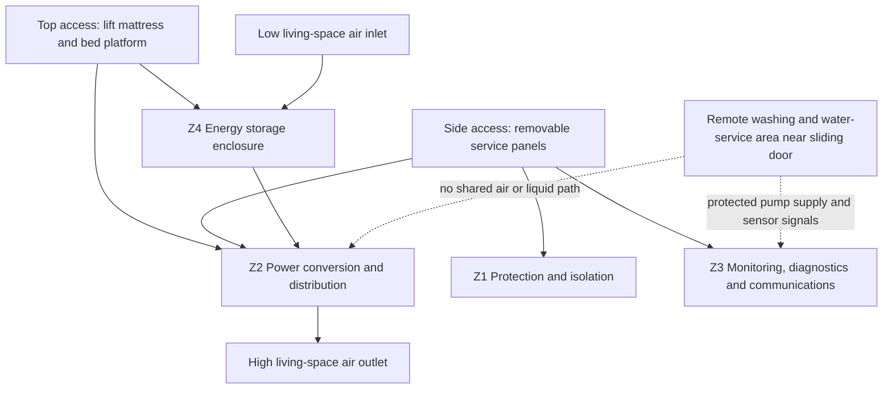

# SC-402-001 Technical Bay Preliminary Design

## 1. Purpose

Define a buildable preliminary architecture for the technical bay integrating house electrical power, monitoring, diagnostics, communications, and service interfaces while preserving safety, payload, thermal performance, and maintainability.

The Design Authority accepted the location, access philosophy, and passive-ventilation baseline in [EM-002](../60-design-reviews/EM-002-technical-bay-and-repository-governance.md) and [ADR-004](../40-decisions/ADR-004-under-bed-technical-bay.md). This document does not yet select dimensions, battery capacity, inverter rating, grille free area, fan rating, or products.

## 2. Design context

- The technical bay is inside the van under a permanent bed and adjacent to the dry toilet compartment.
- The dry toilet compartment contains a Trelino composting toilet and sanitary-item storage only. It contains no sink, shower, fresh-water plumbing, or grey-water plumbing.
- Washing, fresh-water, grey-water, and water-service functions are on the opposite side of the van near the sliding door.
- Major equipment access is from above by lifting the mattress and bed platform.
- Routine service access is through removable side panels.
- Ventilation air comes from and returns to the general living-space volume, not through the toilet compartment or an exterior road-spray path.

## 3. Design drivers and traceability

The technical bay implements or supports:

- [FR-014](../10-requirements/SC-100-001-system-requirements.md): 48 V house backbone with derived voltage domains;
- [FR-033](../10-requirements/SC-100-001-system-requirements.md): solar-first charging with approved backup sources and captain-commanded shore charging;
- [FR-034 through FR-038](../10-requirements/SC-100-001-system-requirements.md): integrated diagnostics and fault isolation;
- [NFR-027 and NFR-028](../10-requirements/SC-100-001-system-requirements.md): remaining payload and active mass budget;
- [NFR-029](../10-requirements/SC-100-001-system-requirements.md): direct maintenance access without dismantling fixed furniture or unrelated systems;
- [NFR-035](../10-requirements/SC-100-001-system-requirements.md): owner explainability;
- [NFR-037 through NFR-039](../10-requirements/SC-100-001-system-requirements.md): scalability, low standby load, and 20-year platform life;
- [NFR-041](../10-requirements/SC-100-001-system-requirements.md): repository synchronization;
- [ADR-001](../40-decisions/ADR-001-48v-house-architecture.md), [ADR-002](../40-decisions/ADR-002-platform-design-life.md), and [ADR-004](../40-decisions/ADR-004-under-bed-technical-bay.md).

## 4. Architectural concept

The under-bed installation is divided into four dry technical zones. The remote water-service area is a separate habitation zone and is not part of the technical bay.

### 4.1 Z1 — Protection and isolation

Contains accessible source/storage protection, manual isolation, and main-bus protection. The emergency/manual disconnect operating element is reachable through a side service panel without removing a power module. Barriers prevent accidental contact and dropped-tool faults while defined test points remain serviceable under controlled procedures.

### 4.2 Z2 — Power conversion and distribution

Contains power converters, distribution bars, branch protection, contactors or relays where justified, and the 48 V, 12 V, and 230 V interfaces. Heat-producing equipment receives the clearest airflow path. High-current paths are short, direct, supported independently of terminals, and segregated from signal wiring.

### 4.3 Z3 — Monitoring, diagnostics, and communications

Contains low-power controllers, gateways, data acquisition, service ports, and diagnostic interfaces. It remains mechanically serviceable if a high-power module is removed. Failure of diagnostics or communications does not remove independent protection or prevent safe manual isolation.

### 4.4 Z4 — Energy storage enclosure

Contains the 48 V house battery and battery-specific protection, monitoring, restraint, and thermal provisions. The battery may occupy a separated enclosure within the same under-bed technical volume if chemistry, crash restraint, ventilation, or service removal requires it.

## 5. Access and service concept

### 5.1 Top access

The mattress and bed platform provide the removal path for the battery and other large or heavy equipment. The platform must remain safely open using a positive mechanical stay, locking support, or equivalent means; gas struts alone are not treated as the sole safety restraint during service.

Top access supports:

- installation and removal of the heaviest modules;
- full-bay inspection and cleaning;
- structural-restraint inspection;
- access to rear fasteners and cable supports;
- major rewiring or reconfiguration.

### 5.2 Side service panels

Removable side panels support routine work without disturbing the mattress or bed platform. Panels use captive screws, quarter-turn fasteners, or an equivalently repeatable fastening method rather than disposable wood-screw holes.

Side access supports:

- inspecting and operating isolators, circuit breakers, and fuses;
- reading status indicators and physical labels;
- connecting diagnostic or service equipment;
- taking defined safe measurements;
- replacing designated smaller modules;
- cleaning ventilation grilles and coarse screens.

Frequently inspected items occupy the first access plane. A second access plane is acceptable only where the first plane hinges or removes as a documented module without disconnecting unrelated circuits.

## 6. Proposed derived design requirements

These requirements remain local to SC-402 until accepted into the SyRS or allocated to a subsystem specification.

| ID | Proposed requirement | Verification concept |
|---|---|---|
| TBR-001 | Routine inspection of protection, indicators, test points, and labels shall be possible through removable side panels without lifting the mattress or dismantling fixed furniture. | Access demonstration |
| TBR-002 | The battery and other designated large modules shall have a documented removal path through the lifted bed platform and shall be removable without cutting conductors or removing unrelated modules. | Replacement demonstration |
| TBR-003 | Side service panels shall be repeatedly removable without degrading the bed structure and shall use captive or controlled reusable fasteners. | Inspection and cycle demonstration |
| TBR-004 | Each designated field-replaceable module shall be removable without cutting conductors and without disconnecting unrelated systems. | Replacement demonstration |
| TBR-005 | The bay shall provide a defined low inlet and high outlet for passive airflow from and to the living-space volume. | Drawing and installation inspection |
| TBR-006 | Ventilation openings shall provide calculated net free area after accounting for grille bars and screens; final area shall be based on the worst credible thermal loss budget. | Calculation and measurement |
| TBR-007 | The layout shall reserve an installation provision for a temperature-controlled extraction fan without making that fan necessary until thermal analysis justifies it. | Layout inspection |
| TBR-008 | Component temperatures shall remain within manufacturer limits at the declared maximum ambient condition and worst credible continuous load. If a fan is fitted, safe degraded behavior for fan failure shall be defined and tested. | Instrumented thermal test |
| TBR-009 | No water pipe, hose joint, filter, pump, fill connection, or drain connection shall be routed within or vertically above the technical bay. | Drawing and installation inspection |
| TBR-010 | Cable routes from the remote water-service area shall be protected, labelled, and arranged so liquid cannot track into the technical bay. | Inspection and controlled wet test |
| TBR-011 | 230 V AC, 48 V power, 12 V power, low-level sensing, and data wiring shall use identified routing channels and suitable separation. | Drawing and installation inspection |
| TBR-012 | Every cable, connector, protective device, switch, relay, sensor, converter, and service point shall carry a stable identifier matching engineering documentation and diagnostic messages. | Traceability inspection |
| TBR-013 | Service connectors shall be keyed or otherwise protected against incorrect mating, and equipment removal shall not require cutting a wire. | Inspection and demonstration |
| TBR-014 | Loss of monitoring, communications, or supervisory control shall not remove independent hardware protection or prevent safe isolation. | Fault-insertion test |
| TBR-015 | Bay structure, equipment mounts, battery restraint, and the bed platform shall withstand applicable vehicle and service loads and shall not rely on removable decorative panels as load paths. | Structural analysis and inspection |
| TBR-016 | Installed mass, centre-of-mass location, service clearances, removal envelopes, and reserved expansion volume shall be stated before layout approval. | Mass and layout review |
| TBR-017 | At least the main 48 V bus, derived 12 V bus, battery state, source/charger state, inverter state, converter state, and bay temperatures shall be observable where supported by open or documented interfaces. | Interface review and functional test |

## 7. Ventilation and thermal concept

Passive ventilation is the baseline. A concentrated low inlet and high outlet are preferred over random perforation across entire panels because defined grilles provide measurable free area, preserve panel stiffness, simplify cleaning, and create a predictable convection path. The inlet and outlet should be separated horizontally where the measured layout permits.

The final design will determine:

- equipment loss by operating mode rather than nominal power alone;
- cabin and bay design ambient temperatures;
- solar loading on the vehicle body;
- allowable battery and electronics temperatures;
- required net free inlet and outlet area;
- airflow resistance from grilles, screens, internal partitions, and cabling;
- whether passive convection is sufficient;
- fan duty, acoustic limit, failure detection, and derating behavior if forced ventilation is required.

The preliminary 150–250 cm² inlet and outlet free-area concept discussed before EM-002 is a design allowance only, not an accepted sizing requirement. It must be replaced by calculation and instrumented testing.

Preferred thermal treatment order:

1. reduce conversion and standby losses;
2. arrange natural convection around heat-producing modules;
3. preserve clear inlet, internal flow, and outlet paths;
4. use heat spreading or conduction where justified;
5. add quiet forced extraction only if passive measures are insufficient;
6. monitor critical temperatures and derate or isolate loads before damage.

## 8. Electrical routing concept

### 8.1 High-current DC

Battery terminals, battery protection, service isolation, current sensing, and main distribution form a compact chain. Positive and return conductors run together to minimize loop area. Conductors are restrained independently of terminals and protected from abrasion and service damage.

### 8.2 Derived 12 V distribution

The 48-to-12 V converter feeds a protected service bus. Essential and non-essential branches are identifiable. A later trade study will decide whether graceful degradation uses dual converters, a cold spare, or rapid field replacement; redundancy is not assumed.

### 8.3 230 V AC

AC distribution has a segregated section, protective devices, warning labels, and explicit shore/inverter source logic. Protective-earth and bonding strategy require an applicable-standards study before schematic approval.

### 8.4 Signals and communications

Sensor and data wiring is segregated from high-current and AC conductors except at documented crossings. Service ports are accessible without exposing unguarded energized power terminals.

## 9. Diagnostics and service levels

| Level | Access state | Permitted activity |
|---|---|---|
| Operator | Panels closed | View status, run BIT, isolate the house system, acknowledge messages |
| Field service | Side panel open; hazardous parts guarded | Inspect labels, replace accessible protection and designated small modules, connect service tool, take defined safe measurements |
| Major service | Bed platform positively supported; system isolated | Remove battery or large modules, inspect structure and main cable routes |
| Specialist | Power isolated and verified; secondary guards removed | High-current, AC, battery, or compliance work under documented procedure |

Diagnostics correlate commands with measured response and report the evidence available. They shall not claim component-level certainty where installed sensors cannot distinguish alternatives.

## 10. Safety concept

- Independent hardware protection does not depend on the supervisory computer.
- The captain can isolate house power quickly; safety shutdowns remain independent of ordinary software override.
- Covers and barriers prevent inadvertent contact and dropped-tool faults.
- Stored energy and multiple sources are labelled at each service access point.
- Mattress and bedding cannot obstruct required ventilation openings in normal use.
- Heat-producing surfaces and fault-energy paths are separated from bedding and combustible finishes by design.
- Battery chemistry-specific hazards remain open until chemistry and installation are selected.
- Vehicle HV is outside the technical-bay design except at an approved documented interface.

## 11. Preliminary interface register

| Interface | From | To | Content | Status |
|---|---|---|---|---|
| IF-401 | Roof solar zone | Z1/Z2 | DC power, isolation, protection, sensing | Preliminary |
| IF-402 | Approved vehicle source | Z1/Z2 | Charging power, enable/status, isolation boundary | Feasibility open |
| IF-403 | Shore inlet | Z1/Z2 AC section | 230 V AC, PE, presence/authorization state | Preliminary |
| IF-404 | Z4 battery enclosure | Z1 protection | 48 V power, BMS state, temperature, isolation | Preliminary |
| IF-405 | Z2 distribution | Habitation zones | Protected 48 V/12 V/230 V branches | Preliminary |
| IF-406 | Z3 controls | HMI | Commands, modes, status, alarms, diagnostics | Preliminary |
| IF-407 | Remote water-service area | Z2/Z3 | Protected pump power, level/leak/flow signals | Preliminary |
| IF-408 | Technical bay | Vehicle/body and bed structure | Structure, cooling air, bonding as required, mass and service loads | Preliminary |

Electrical characteristics remain to be baselined in the ICD.

## 12. Verification strategy

Verification combines:

- measured 3D/access-envelope review;
- mass-properties and structural analysis;
- mattress/bed-platform opening and positive-support demonstration;
- repeated side-panel removal and refit demonstration;
- timed module-removal demonstrations using the onboard toolkit;
- electrical protection, voltage-drop, fault-current, and selectivity analysis;
- worst-case thermal analysis followed by instrumented passive-ventilation testing;
- grille free-area measurement and blocked-vent/fan-failure degraded-mode tests where applicable;
- wiring/label/document traceability inspection;
- sensor and communications fault insertion;
- emergency isolation demonstration.

## 13. Risks and mitigations

This design treats [R-001, R-002, R-004, R-005, R-006, R-008, and R-009](../50-risk/SC-950-001-risk-register.md). Location selection is accepted, but dimensional, structural, mass, acoustic, and thermal feasibility remain unverified. No mounting hole, furniture interface, or component purchase may rely on assumed clearances.

## 14. Required inputs and open decisions

| Action | Required output | Blocks |
|---|---|---|
| A-402-001 | Measured Renault L2H2 geometry at the selected under-bed location, including ribs, floor build-up, wheel arch, body-builder exclusions, and service-panel envelope | Detailed bay layout |
| A-402-002 | Dimensioned bed, dry-toilet, aisle, side-panel, and wash/water-area layout | Access and routing approval |
| A-402-003 | Daily, peak, and worst-continuous electrical load budget | Converter, inverter, protection, and thermal envelopes |
| A-402-004 | Battery capacity and chemistry trade study | Z4 envelope and safety concept |
| A-402-005 | Applicable Swiss/EU electrical, vehicle, EMC, fire, and registration review | Detailed protection and compliance design |
| A-402-006 | Equipment envelope library using at least two plausible product families per major function | Access and expansion study |
| A-402-007 | Renault/body-builder-approved traction or auxiliary interface evidence | IF-402 feasibility |
| A-402-008 | Passive ventilation calculation and instrumented test plan | Grille sizing and fan decision |
| A-402-009 | Structural and crash-restraint concept for battery, equipment, and bed platform | Mounting approval |

## 15. Exit criteria for preliminary layout approval

SC-402 may advance to approved preliminary layout when:

- the selected under-bed volume is measured and modeled;
- major and routine access paths are demonstrated with representative module envelopes;
- mass, structure, cable routes, service access, noise, and thermal concepts close without unresolved critical risk;
- passive ventilation is sized by calculation and validated by an instrumented plan;
- representative modules can be removed through the specified access path;
- interfaces are allocated to accountable systems;
- applicable compliance constraints are identified from authoritative sources;
- residual risks and growth reserves are explicitly accepted by the Design Authority.
