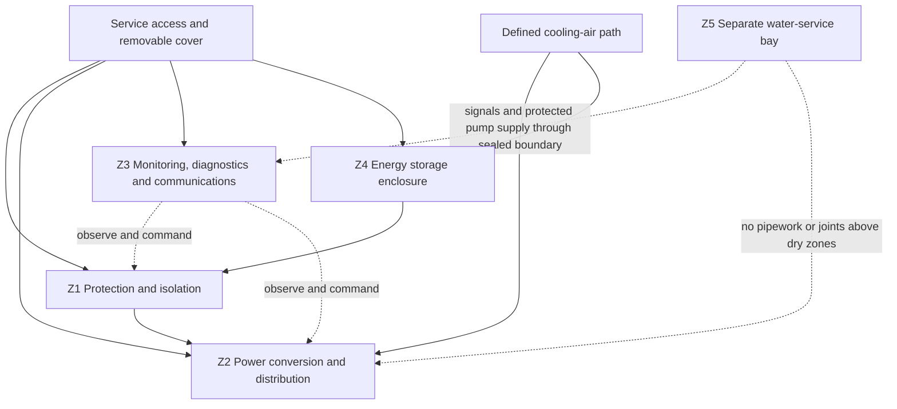

# SC-402-001 Technical Bay Preliminary Design

## 1. Purpose

Define a buildable preliminary architecture for the technical bay that integrates house electrical power, monitoring, diagnostics, communications, and service interfaces while preserving safety, payload, thermal performance, and maintainability.

This document defines functions, zones, interfaces, and decision criteria. It does **not** select a final vehicle location, dimensions, battery capacity, inverter rating, or product.

## 2. Design drivers

The technical bay implements or supports:

- [FR-014](../10-requirements/SC-100-001-system-requirements.md): 48 V house backbone with derived voltage domains;
- [FR-033](../10-requirements/SC-100-001-system-requirements.md): solar-first charging with approved backup sources and captain-commanded shore charging;
- [FR-034 through FR-038](../10-requirements/SC-100-001-system-requirements.md): integrated diagnostics and fault isolation;
- [NFR-027 and NFR-028](../10-requirements/SC-100-001-system-requirements.md): remaining payload and active mass budget;
- [NFR-029](../10-requirements/SC-100-001-system-requirements.md): direct maintenance access without dismantling unrelated systems;
- [NFR-035](../10-requirements/SC-100-001-system-requirements.md): owner explainability;
- [NFR-037 through NFR-039](../10-requirements/SC-100-001-system-requirements.md): scalability, low standby load, and 20-year platform life;
- [ADR-001](../40-decisions/ADR-001-48v-house-architecture.md) and [ADR-002](../40-decisions/ADR-002-platform-design-life.md).

## 3. Architectural concept

The technical installation is divided into physically and functionally distinct zones. A single access opening may serve several dry electrical zones, but the wet-service zone is separated by a liquid-resistant barrier and independent drainage path.

### 3.1 Z1 — Protection and isolation

Contains the first accessible protective and isolation functions associated with sources, storage, and main buses. The emergency/manual disconnect operating element is reachable without removing equipment. Covers prevent accidental contact while allowing safe inspection and measurement at defined test points.

### 3.2 Z2 — Power conversion and distribution

Contains power converters, distribution bars, branch protection, contactors/relays where justified, and the interfaces to 48 V, 12 V, and 230 V domains. High-current paths are short, direct, mechanically supported, and separated from signal wiring.

### 3.3 Z3 — Monitoring, diagnostics, and communications

Contains low-power controllers, gateways, data acquisition, service ports, and diagnostic interfaces. It remains electrically and mechanically serviceable if a high-power converter is removed. Diagnostic failure must not prevent safe manual operation of essential loads.

### 3.4 Z4 — Energy storage enclosure

Contains the house battery and battery-specific protection, monitoring, restraint, and thermal provisions. The battery may be adjacent to rather than inside the electronics cabinet when mass distribution, crash restraint, ventilation, or service removal makes separation preferable.

### 3.5 Z5 — Water-service bay

Contains pumps, filters, valves, drains, and wet-system service points. It is not part of the dry electrical bay. Only intentionally protected electrical loads and sensors cross the sealed boundary. Water cannot drain, spray, or wick toward energized equipment.

## 4. Proposed derived design requirements

These requirements are **proposed** for Design Authority review. Their IDs are local to SC-402 until accepted into the SyRS or allocated to a subsystem specification.

| ID | Proposed requirement | Verification concept |
|---|---|---|
| TBR-001 | Routine inspection of protection, indicators, test points, and labels shall be possible through one primary service opening without dismantling furniture. | Access demonstration |
| TBR-002 | Each designated field-replaceable module shall have a documented removal path and shall be removable without cutting conductors, draining the water system, or removing unrelated modules. | Replacement demonstration |
| TBR-003 | No water pipe, hose joint, filter, pump, fill connection, or drain connection shall be located vertically above a dry electrical zone. | Drawing and installation inspection |
| TBR-004 | The lowest dry electrical component and uninsulated energized connection shall remain above the defined maximum credible liquid level, including blocked-drain condition. | Analysis and measurement |
| TBR-005 | Cable entries between wet and dry zones shall be sealed, strain-relieved, labelled, and routed to prevent liquid tracking along the cable into the dry zone. | Inspection and spray test |
| TBR-006 | The bay shall provide defined inlet and outlet airflow or a justified passive thermal path for all declared operating modes. | Thermal analysis and test |
| TBR-007 | Component temperatures shall remain within manufacturer limits at the declared maximum ambient condition and worst credible continuous load, including defined degradation for a failed fan where a fan is used. | Instrumented thermal test |
| TBR-008 | 230 V AC, 48 V power, 12 V power, low-level sensing, and data wiring shall use identified routing channels and separation appropriate to voltage, current, EMC, and applicable standards. | Drawing and installation inspection |
| TBR-009 | Every cable, connector, protective device, switch, relay, sensor, converter, and service point shall carry a stable physical identifier matching the engineering documentation and diagnostic messages. | Traceability inspection |
| TBR-010 | Service connectors shall be keyed or otherwise protected against incorrect mating, and equipment removal shall not require cutting a wire. | Inspection and demonstration |
| TBR-011 | A leak sensor shall detect liquid at the lowest credible ingress point before liquid reaches energized dry-zone components and shall produce a locally visible diagnostic event. | Controlled leak test |
| TBR-012 | Loss of monitoring, communications, or supervisory control shall not remove independent hardware protection or prevent safe isolation. | Fault-insertion test |
| TBR-013 | The bay structure, equipment mounts, and battery restraint shall withstand applicable vehicle loads and shall not rely on decorative furniture panels as the sole load path. | Structural analysis and inspection |
| TBR-014 | The design shall state installed mass, centre-of-mass location, service clearances, and reserved expansion envelope before layout approval. | Mass and layout review |
| TBR-015 | At least the main 48 V bus, derived 12 V bus, battery state, source/charger state, inverter state, converter state, and bay temperatures shall be observable by diagnostics where supported by open or documented interfaces. | Interface review and functional test |

## 5. Physical layout rules

### 5.1 Access and removal

- Primary service access should expose protection and status before high-power modules.
- Frequently inspected items occupy the first access plane; rarely replaced items may occupy a second plane only if the first plane hinges or removes as a documented module.
- A module's connector release, fasteners, lifting grip, and removal trajectory remain accessible with onboard tools.
- The design includes hand clearance, tool swing, bend radius, cover removal, and module mass—not only equipment envelope dimensions.
- Equipment is not used as a step, shelf support, or restraint surface.

### 5.2 Candidate location criteria

The final bay location will be selected by trade study after measuring the Renault Master E-Tech electric L2H2 vehicle and preliminary living layout. Criteria are:

1. short battery-to-protection-to-inverter current path;
2. safe structural anchoring and crash-load path;
3. low and balanced mass placement without compromising NFR-027;
4. service access from inside or rear without unloading the living area;
5. separation from wet systems, exterior spray, cooking heat, and bedding;
6. achievable cooling-air path without exposing electronics to road contamination;
7. short, protected routes to roof solar, shore inlet, 12 V zones, HMI, and approved vehicle interface;
8. a removal path for the heaviest module through an existing door;
9. limited noise transmission to sleeping positions;
10. reserved expansion volume for the 20-year design life.

No location is preferred until these criteria are scored against measured candidates.

## 6. Electrical routing concept

### 6.1 High-current DC

Battery terminals, battery protection, service isolation, contactor where required, shunt/current sensor, and main distribution form a compact high-current chain. Positive and return conductors are routed together to minimize loop area. Conductors are supported independently of terminals and protected from abrasion and mechanical damage.

### 6.2 Derived 12 V distribution

The 48-to-12 V converter feeds a protected service bus. Essential and non-essential branches are identifiable. The trade study will determine whether graceful degradation requires dual converters, a cold spare, or simple field replacement; redundancy is not assumed.

### 6.3 230 V AC

AC distribution has its own enclosure/segregated section, protective devices, clear warning labels, and shore/inverter source logic. Protective-earth and bonding strategy require an applicable-standards study before schematic approval.

### 6.4 Signals and communications

Sensor and data wiring uses separate routing from high-current and AC conductors except at documented crossings. Service ports are accessible without exposing energized power terminals. Network loss is a diagnosable degraded mode, not a reason for essential protection to fail.

## 7. Thermal concept

The thermal design proceeds from a loss budget, not nominal equipment power. For each operating mode, record converter/inverter losses, battery heat, standby losses, ambient temperature, solar loading on the vehicle body, allowable component temperature, and airflow impedance.

Preferred treatment order:

1. reduce conversion and standby loss;
2. place heat-producing equipment with natural separation and convection paths;
3. conduct heat to a safe structure or dedicated heat spreader where justified;
4. provide filtered forced airflow only when passive measures are insufficient;
5. monitor critical temperatures and derate or isolate loads before damage.

If forced ventilation is necessary, fan failure is detected and produces a defined degraded-power state. Cooling air from the wet bay, toilet compartment, or unfiltered road environment is not used.

## 8. Diagnostics and service concept

The bay supports three service levels:

| Level | Access state | Permitted activity |
|---|---|---|
| Operator | Covers closed | View status, run BIT, isolate system, acknowledge messages |
| Field service | Primary service cover open; hazardous parts guarded | Inspect labels, replace accessible protection and designated modules, connect service tool, take safe measurements |
| Specialist | Power isolated and verified; secondary guards removed | High-current, AC, battery, or compliance work under documented procedure |

Diagnostics correlate commands with measured response. Examples include commanded converter enable versus 12 V bus voltage, pump command versus branch current, and solar input availability versus charging output. The software reports evidence and likely fault domain; it does not claim component-level certainty where sensors cannot distinguish alternatives.

## 9. Safety concept

- Independent hardware protection does not depend on the supervisory computer.
- The captain can isolate house power quickly; safety shutdowns remain independent of ordinary software override.
- Covers and barriers prevent inadvertent contact and dropped-tool faults.
- Stored energy and multiple possible sources are labelled at service access points.
- Battery chemistry-specific hazards remain open until chemistry and installation are selected.
- Fire detection, extinguishing strategy, venting, emergency access, and post-event isolation require a dedicated safety analysis.
- Vehicle HV is outside the technical-bay design except at an approved, documented interface.

## 10. Preliminary interface register

| Interface | From | To | Content | Status |
|---|---|---|---|---|
| IF-401 | Roof solar zone | Z1/Z2 | DC power, isolation, protection, sensing | Preliminary |
| IF-402 | Approved vehicle source | Z1/Z2 | Charging power, enable/status, isolation boundary | Feasibility open |
| IF-403 | Shore inlet | Z1/Z2 AC section | 230 V AC, PE, presence/authorization state | Preliminary |
| IF-404 | Z4 battery enclosure | Z1 protection | 48 V power, BMS state, temperature, isolation | Preliminary |
| IF-405 | Z2 distribution | Vehicle habitation zones | 48 V/12 V/230 V protected branches | Preliminary |
| IF-406 | Z3 controls | HMI | Commands, modes, status, alarms, diagnostics | Preliminary |
| IF-407 | Z5 water-service bay | Z2/Z3 | Protected pump power, level/leak/flow signals | Preliminary |
| IF-408 | Technical bay | Vehicle/body | Structure, cooling air, bonding as required, mass loads | Preliminary |

These identifiers are reserved for later ICD development; electrical characteristics are not yet baselined.

## 11. Verification strategy

Verification will combine:

- 3D/access-envelope review using representative or final component volumes;
- mass-properties and structural analysis;
- electrical protection, voltage-drop, fault-current, and selectivity analysis;
- worst-case thermal analysis followed by instrumented testing;
- controlled water-ingress and blocked-drain tests with safe substitute equipment where appropriate;
- module-removal demonstrations timed with the onboard toolkit;
- wiring/label/document traceability inspection;
- sensor and communications fault insertion;
- emergency isolation and degraded-operation demonstrations.

## 12. Risks and mitigations

This design directly treats [R-001, R-002, R-004, R-005, R-006, and R-008](../50-risk/SC-950-001-risk-register.md). The following new risk is proposed for the risk register:

> Because the living layout and equipment envelopes are not yet measured, premature selection of a technical-bay location could create inaccessible modules, poor weight distribution, excessive cable routes, or inadequate cooling.

Mitigation is to use candidate envelopes and a scored location trade study before approving mounting holes or furniture interfaces.

## 13. Required inputs and open decisions

| Action | Required output | Blocks |
|---|---|---|
| A-402-001 | Measured Renault Master E-Tech electric L2H2 interior/body model including doors, ribs, wheel arches, floor build-up, underbody and HV exclusion zones, and prohibited drill/cut zones | Location trade study |
| A-402-002 | Preliminary habitation layout with two bed envelopes, toilet, storage, and access paths | Candidate bay locations |
| A-402-003 | Initial daily/peak energy and load budget | Converter, inverter, protection, and thermal envelopes |
| A-402-004 | Preliminary battery capacity and chemistry trade study | Z4 envelope and safety concept |
| A-402-005 | Applicable Swiss/EU electrical, vehicle, EMC, fire, and registration requirements review | Detailed protection and compliance design |
| A-402-006 | Candidate equipment envelope library using at least two plausible product families per major function | Access and expansion study |
| A-402-007 | Renault/body-builder-approved traction or auxiliary interface evidence | IF-402 feasibility |
| A-402-008 | Technical-bay location trade study | Layout approval |

## 14. Exit criteria for preliminary layout approval

SC-402 may advance from architectural concept to approved preliminary layout when:

- the Design Authority accepts or modifies the proposed derived requirements;
- candidate locations have been measured and scored;
- mass, structural, cable-route, service, water-separation, and thermal concepts close without unresolved critical risk;
- representative modules can be removed through the proposed access path;
- interfaces are allocated to accountable systems;
- applicable compliance constraints are identified from authoritative sources;
- residual risks and growth reserves are explicitly accepted.
