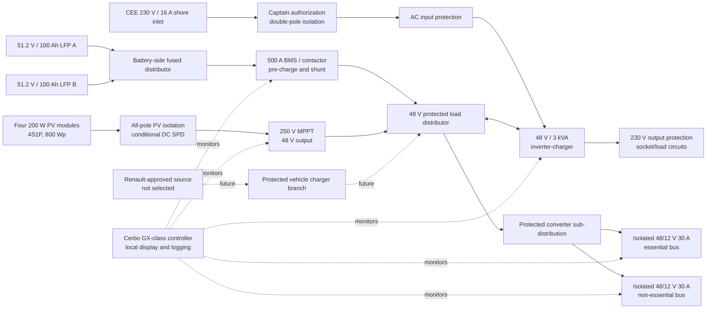

# SC-410-001 Electrical and Solar Preliminary Design

## 1. Purpose and maturity

Define the next controlled preliminary design of the SolarChaser house-electrical system, including the roof photovoltaic array, 48 V storage and distribution, derived 12 V buses, 230 V inverter/shore domain, monitoring, protection boundaries, component envelopes, mass, and verification gates.

This design turns the accepted architecture and load envelopes into a complete candidate system for packaging, thermal, mass, compliance, and procurement analysis. It does **not** authorize component purchase, roof drilling, cable installation, energization, or connection to any Renault vehicle or traction-energy interface. Product names are configuration-specific packaging baselines until every gate in Section 18 is closed.

## 2. Controlled design basis

| Input | Controlled value | Source / status |
|---|---|---|
| House backbone | 48 V DC | [ADR-001](../40-decisions/ADR-001-48v-house-architecture.md), accepted |
| Derived service voltage | 12 V DC; no 24 V bus | ADR-001, accepted |
| Battery chemistry | LFP | [EM-004](../60-design-reviews/EM-004-battery-capacity-and-chemistry-trade.md), approved |
| Battery packaging envelope | 10.24 kWh / 74 kg battery-only | EM-004, approved; not a product selection |
| Summer source-side load | 2.608 kWh/day | [EM-003](../60-design-reviews/EM-003-preliminary-electrical-load-budget.md), approved estimate |
| Winter source-side load | 2.386 kWh/day | EM-003, approved estimate |
| Arithmetic continuous/peak envelope | 1.557 kW / 2.256 kW | EM-003; no diversity credit |
| Roof-load input | 200 kg | Design Authority input, 2026-07-12; vehicle-specific evidence open |
| Maximum registered mass | 3,500 kg | NFR-040, accepted |
| Remaining payload target | at least 500 kg | NFR-027, accepted |
| Vehicle energy interface | no OEM-HV modification; approved interface only | SC-095 / R-003; feasibility open |

## 3. Proposed system baseline

The preliminary baseline is:

- four compact 200 W rigid photovoltaic modules in one 4S1P string, 800 Wp total;
- one 250 V-class MPPT connected to the 48 V bus;
- two parallel 51.2 V, 100 Ah LFP modules, 10.24 kWh nominal total;
- a dedicated BMS with main safety contactor, pre-charge, shunt, cell monitoring, and charger/load control;
- protected battery-side aggregation and load-side distribution;
- one 48 V / 3 kVA inverter/charger for the 230 V domain;
- two independent isolated 48-to-12 V, 30 A converters feeding essential and non-essential buses;
- one local system controller with hard-wired communications, local display, temperature sensing, logging, and export;
- a reserved but electrically absent vehicle-source charging branch until Renault and MFK evidence closes the interface.

The baseline uses a predominantly Victron candidate ecosystem to reduce protocol adapters and prove packaging. This is not a vendor lock-in decision: every functional interface remains documented and alternative products must be evaluated before procurement.

## 4. Power architecture

Connection-level terminals, pin designations, conductor paths and the component cross-reference are documented in [EC-WD-001 Electrical Core Wiring Diagram](../../drawings/export/EC-WD-001-electrical-core-wiring-diagram.pdf). The [editable generator](../../drawings/src/EC-WD-001-electrical-core-wiring-diagram.py) validates all component IDs and names against the controlled BOM before producing the export.

Independent fuses, BMS contactor logic, equipment-local protection, manual isolation, and AC protective devices remain authoritative even if the supervisory controller or communications fail.

## 5. Roof photovoltaic design

### 5.1 Candidate module and geometry

The packaging baseline uses four Renogy ShadowFlux `RSP200DC-ASR-G1` rigid 200 W modules. Manufacturer data used by the calculation are:

| Parameter | Per module | Four-module array |
|---|---:|---:|
| Rated power | 200 W | 800 Wp |
| Maximum-power voltage | 31.3 V | 125.2 V in 4S |
| Maximum-power current | 6.38 A | 6.38 A |
| Open-circuit voltage | 36.5 V | 146.0 V at STC |
| Short-circuit current | 6.86 A | 6.86 A |
| Dimensions | 1262 × 764 × 30 mm | 2549 × 1553 mm bounding rectangle before perimeter clearance |
| Mass | 10.81 kg | 43.24 kg |

The assumed two-by-two rectangle is only a packaging hypothesis. A roof scan must confirm usable flat/rib-supported area, curvature, seam locations, manufacturer exclusion zones, cable entry, wash access, shading, required perimeter clearance, and compatibility with any roof hatch before layout approval.

### 5.2 String voltage and MPPT

The four modules form one series string. The reproducible calculation carries:

- 164.25 V conservative open-circuit voltage at a -25 °C cell temperature;
- 85.75 V margin to a 250 V MPPT absolute limit;
- 103.3 V conservative maximum-power voltage at a 75 °C cell temperature;
- 41.5 V margin above the 56.8 V battery maximum plus the MPPT's 5 V start requirement.

The hot-Vmp coefficient is an explicitly conservative assumption pending a complete selected-module temperature model. Final validation shall use the declared coldest operating location, actual module coefficients, conductor drop, and selected MPPT manual.

The candidate charger is a Victron SmartSolar MPPT 250/60-Tr. Its 60 A output capability is much larger than the approximately 15 A available from the 800 W array at charging voltage. The selection is driven by the 4S cold-voltage requirement and current product range, not by a need for 60 A. The protected output branch is therefore sized to the installed array and cable, not blindly to the charger's nameplate; configuration shall prevent undocumented future PV expansion.

### 5.3 Energy result

The preliminary 70% end-to-end derate produces:

| Season | Peak-sun-hours assumption | Planning yield | Comparison with current design day |
|---|---:|---:|---|
| Summer | 5.0 h/day | 2.80 kWh/day | approximately covers 2.61 kWh/day |
| Shoulder | 3.0 h/day | 1.68 kWh/day | charging deficit expected |
| Winter | 1.5 h/day | 0.84 kWh/day | substantial charging deficit expected |

Solar-first does not mean solar-only. Location, shade, orientation, snow, dirt, module temperature, battery state, and load behavior can reduce yield. Shore charging remains the controlled backup. Vehicle charging remains conditional.

### 5.4 Roof mass and structural boundary

| Roof item | Preliminary mass |
|---|---:|
| Four PV modules | 43.24 kg |
| Rails, brackets, adhesive, fasteners | 15.0 kg estimate |
| UV wiring, support, connectors and gland | 3.0 kg estimate |
| Fixed solar total | 61.24 kg |
| Reserve within 75 kg roof planning allocation | 13.76 kg |
| Unallocated margin to 200 kg project input after the 75 kg allocation | 125 kg |

The 200 kg figure is treated as a Design Authority input, not yet as a verified Renault allowance. It is not a substitute for:

- vehicle-specific roof-load documentation;
- local load and rib-capacity analysis;
- dynamic and crash loading;
- aerodynamic uplift and cross-wind analysis;
- fatigue, vibration, adhesive and fastener qualification;
- corrosion protection and watertight penetration design;
- remaining vehicle payload and axle-load compliance.

No roof mounting or penetration may be released until these items and the MFK/APS route are closed.

## 6. Energy storage and battery management

The packaging baseline uses two Victron Lithium NG 51.2 V, 100 Ah batteries in parallel. Each module provides 5.12 kWh nominal energy, 100 A continuous charge/discharge capability, 200 A 10-second pulse capability, and a manufacturer-estimated mass of 37 kg. Charge is prohibited below +5 °C by the product specification.

The bank therefore provides:

- 10.24 kWh nominal energy;
- 200 Ah nominal capacity at 51.2 V;
- 200 A aggregate continuous current before system derating;
- 74 kg battery-only mass.

The candidate Lynx Smart BMS NG 500A is required by the candidate batteries and provides a main contactor, pre-charge, battery monitor/shunt, cell/temperature communications, and charger/load control. Its 500 A rating is not the system operating target. The controlled bank limit remains 200 A or a lower value determined by cables, fuses, thermal analysis, and authority requirements.

Each battery has an equal-length branch and independent provisional 125 A protection before battery-side aggregation. Final fuse technology and interrupt rating require the supplier's prospective short-circuit data and an installation fault-current study. The battery system requires structural restraint independent of furniture, protected terminals, service removal, temperature monitoring, defined venting/thermal behavior, manual isolation, and no charging below the allowed temperature.

## 7. 48 V distribution and inverter/charger

The load-side 48 V distributor provides four protected functional branches:

1. MultiPlus-II inverter/charger;
2. MPPT solar charger;
3. local sub-distribution for the two 48-to-12 V converters and controls;
4. reserved, unpopulated branch for a future Renault-approved vehicle-source charger.

The candidate MultiPlus-II 48/3000/35-32 provides:

- 3000 VA / 2400 W continuous output at 25 °C;
- 2200 W continuous output at 40 °C;
- 1700 W continuous output at 65 °C;
- 5500 W peak output;
- 35 A maximum battery charging from AC;
- 11 W zero-load consumption, reducible by search/disabled modes;
- a manufacturer installation basis of 125 A DC protection and 35 mm² cable for the applicable battery range, subject to actual route and installation conditions.

This rating covers the current 1500 W user-load peak with margin. It is not approval for unrestricted simultaneous loads or fixed electric cooking. The inverter is normally disabled when AC is not required to control standby energy.

## 8. Derived 12 V architecture

Two isolated 48/12 V, 30 A, 360 W converter candidates divide the service loads:

| Bus | Allocated loads | Design intent |
|---|---|---|
| Essential 12 V | refrigerator, water pump, minimum ventilation, monitoring sensors, critical communications | preserve minimum habitation function after non-essential failure |
| Non-essential 12 V | general lighting beyond minimum, USB/user charging, optional fan and discretionary accessories | shed first under low energy or fault conditions |

Each converter feeds a separately protected 12-circuit fuse block. The current EM-003 continuous allocation fits within one 30 A converter per bus, but measured transients, temperature derating and final load allocation must be verified. The buses are not normally paralleled. Any emergency cross-feed requires a break-before-make arrangement and an approved operating procedure.

## 9. 230 V shore and inverter domain

The 230 V domain contains:

- CEE 230 V / 16 A shore inlet;
- double-pole captain-authorization isolation before shore charging;
- shore presence indication independent of authorization;
- input overcurrent and residual-current protection as required by the confirmed Swiss design basis;
- MultiPlus-II transfer, inverter and charger;
- output residual-current and overcurrent protection;
- segregated socket/load circuits;
- protective-earth, bonding and neutral-source logic designed and tested by a qualified person.

The final design shall resolve RCD/RCBO type, neutral-to-earth behavior in shore and inverter modes, source transfer, conductor identification, chassis bonding, equipotential bonding, external supply polarity, disconnection times, test points, and initial verification. The captain's shore command must not bypass electrical protection.

## 10. Renault vehicle-source charging boundary

No house-system connection to Renault traction HV or the OEM 12 V network is authorized by this design. The future branch remains unpopulated until the project obtains:

- exact VIN-specific Renault body-builder interface documentation;
- available voltage, continuous/peak power and duty limits;
- enable, wake/sleep, isolation and fault behavior;
- warranty and homologation position;
- MFK/APS acceptance route;
- configuration-matched charger and EMC evidence.

Solar and captain-commanded shore charging close the operational architecture without assuming that this interface will become available.

## 11. Monitoring, diagnostics and control

A Cerbo GX MK2-class controller and local GX Touch 50-class display are the packaging baseline. Hard-wired VE.Bus, VE.Can and VE.Direct links are preferred over Bluetooth for installed operation. The system shall monitor, where interfaces permit:

- battery state of charge, current, cell voltages, temperatures and BMS state;
- battery contactor and pre-charge state;
- PV voltage, current, yield and MPPT state;
- inverter/charger state, AC input, AC output and shore authorization;
- both 12 V converter outputs and bus voltages;
- load-side distributor fuse states;
- technical-bay inlet, outlet, battery and power-electronics temperatures;
- active and historical warnings and faults.

Loss of the controller, display, network or remote portal shall not defeat hardware protection, manual isolation, or safe local operation. Remote access is optional; core functions remain local.

## 12. Preliminary cable and protection schedule

The controlled schedule is [`electrical-cable-schedule.csv`](../../calculations/electrical-cable-schedule.csv). It presently carries:

- 6 mm² for the 4S PV string;
- 10 mm² for the MPPT output;
- equal-length 35 mm² battery-module branches;
- 70 mm² for the provisional 200 A aggregate battery/BMS path;
- 35 mm² for the 75 A inverter branch;
- 6 mm² for the combined converter input branch;
- 10 mm² for each 30 A 12 V converter output;
- 2.5 mm² for preliminary 16 A shore and 11 A inverter-output AC routes.

All calculated voltage drops are below the declared 1–2% planning limits. Sizes and protection are not build values until actual route length, temperature, bundling, conductor insulation, terminal capacity, voltage rating, fault current, interrupt rating, applicable standard and qualified review are confirmed.

The PV string is an approximately 164 V cold-open-circuit source that remains energized in daylight. It requires touch-safe connectors, inaccessible supported routing, all-pole service isolation, warning labels, safe test points, a defined covering procedure, and insulation/polarity verification before connection.

## 13. Component and mass register

The controlled preliminary BOM is [`electrical-core-bom.csv`](../../calculations/electrical-core-bom.csv). It covers all core source, storage, conversion, distribution, monitoring, protection, wiring and mounting functions. It does not yet select individual habitation appliances or authorize procurement.

The current electrical-core mass is 216.82 kg:

| Confidence | Mass |
|---|---:|
| Manufacturer-supported candidate values | 148.82 kg |
| Estimated ancillary installation mass | 68.00 kg |
| Total | 216.82 kg |

This result materially tightens R-001. Against Renault's published 844–1132 kg payload range, the electrical core alone would leave approximately 627–915 kg before furniture, insulation, water, heating, occupants and all other conversion equipment. Meeting NFR-027 requires the exact high-payload vehicle configuration and a complete conversion mass budget before procurement.

## 14. Thermal and ventilation envelope

At worst credible continuous operation, losses from the inverter, MPPT, converters, cabling and controls can produce material heat below the bed. Preliminary design shall carry at least:

- inverter loss at declared continuous AC output and high ambient;
- two converter losses at 40 °C and above, including derating;
- MPPT loss at full 800 W solar input;
- BMS, contactor, busbar, fuse and cable I²R losses;
- charger loss during full 35 A shore charging;
- simultaneous charging and habitation-load cases;
- solar heating of the body and blocked-grille fault cases.

The existing passive low-inlet/high-outlet baseline remains. Equipment placement and net free area follow a reproducible loss/airflow calculation and instrumented thermal test. The reserved fan is not credited for safe normal operation until failure behavior is defined.

## 15. Operating and degraded states

| State | Required behavior |
|---|---|
| Normal solar | MPPT charges within BMS limits; discretionary loads follow energy policy |
| Low solar | battery supplies essential loads; non-essential loads may be shed |
| Authorized shore | protected shore input powers loads and charges within configured current limit |
| Shore present, not authorized | indication available; charger remains disconnected or disabled |
| BMS charge inhibit | all controlled chargers stop without loss of required load protection |
| BMS discharge inhibit | main contactor opens according to controlled sequence; fault remains locally identifiable |
| One 12 V converter failed | affected bus isolates; essential bus remains available if its converter is healthy |
| MPPT failed or PV isolated | no solar charging; shore backup remains available |
| Controller/network failed | independent protection remains; safe manual isolation is possible |
| Excess temperature | derate or isolate affected sources/loads; alarm and event log retained where possible |
| Vehicle source unavailable | no functional change because the branch is not part of the current baseline |

## 16. Derived design requirements

| ID | Requirement | Verification concept |
|---|---|---|
| TBR-023 | The roof PV system shall provide a nominal 800 Wp packaging baseline using a string voltage that remains below the MPPT absolute maximum at the declared cold temperature and above the required charging threshold at the declared hot temperature. | Calculation and environmental review |
| TBR-024 | Permanently installed roof equipment shall remain within the lower of the confirmed vehicle-specific allowance and 200 kg, with verified load distribution, attachment, dynamic loading, aerodynamic uplift, fatigue, corrosion and watertightness. | Manufacturer/APS evidence, analysis and inspection |
| TBR-025 | The PV source shall be all-pole isolatable and treated as energized whenever illuminated; labels, touch-safe routing, covering and test procedures shall address its maximum cold open-circuit voltage. | Inspection and electrical safety test |
| TBR-026 | Each parallel battery module shall have equal-length conductors, independent protection and configuration-matched BMS integration. | Drawing review, measurement and functional test |
| TBR-027 | The battery/BMS/distribution system shall enforce the lowest current and temperature limit of the batteries, conductors, protection, terminals, equipment and approved installation configuration. | Settings audit and fault test |
| TBR-028 | Essential and non-essential 12 V loads shall be supplied from separate protected converter/bus paths so that a non-essential fault does not remove minimum habitation functions. | Fault-insertion test |
| TBR-029 | Shore charging shall require an explicit captain command while all required AC protection remains independent of that command. | Functional and electrical safety test |
| TBR-030 | Loss of supervisory communications shall not defeat BMS, overcurrent, residual-current, isolation or thermal protection. | Fault-insertion test |
| TBR-031 | The electrical-core mass budget shall include every installed item above 0.5 kg and retain separate manufacturer-supported and estimated totals until final weighing. | Mass-register audit and staged weighing |
| TBR-032 | No vehicle-source charger shall be installed or energized before written Renault interface evidence and authority acceptance are recorded. | Configuration and evidence audit |

## 17. Verification strategy

Before detailed-design release:

1. measure the usable roof and technical-bay envelopes;
2. obtain the exact CoC/eCoC and Renault body-builder documentation;
3. verify the 200 kg roof input and local load distribution in writing;
4. perform roof attachment, uplift, dynamic, fatigue and ingress analyses;
5. rerun PV cold/hot voltage and yield calculations for the final module and mission locations;
6. perform battery prospective fault-current and protection interrupt-rating study;
7. close cable ampacity and voltage-drop schedules with measured routes and installation factors;
8. complete the 230 V design and initial-verification plan with a qualified person;
9. complete EMC and authority evidence matrices for exact part numbers and firmware;
10. complete a thermal loss model and instrumented bay test;
11. demonstrate BMS, charger, inverter, converter, isolation and degraded-state behavior;
12. weigh after roof installation, after electrical installation and at completed vehicle state.

## 18. Approval and procurement gates

| Gate | Exit evidence |
|---|---|
| EP-G1 Vehicle and roof | exact vehicle data, 200 kg source, roof geometry, Renault exclusions, MFK/APS route |
| EP-G2 Solar layout | selected module drawing, no-shade/vent layout, attachment and uplift approval, cold/hot electrical validation |
| EP-G3 Battery system | exact battery/BMS certificates, fault current, fuse coordination, restraint, thermal and service-removal approval |
| EP-G4 DC system | final one-line diagram, cable schedule, protection study, labels, isolation and test plan |
| EP-G5 AC system | qualified 230 V design, shore/inverter neutral-earth logic, protection schedule and inspection route |
| EP-G6 Monitoring | interface matrix, alarm list, offline behavior, data export and cyber/remote-access configuration |
| EP-G7 Mass and thermal | complete vehicle mass/axle budget, measured bay geometry, loss model and passing thermal test |
| EP-G8 Procurement | configuration-matched quotations, evidence, manuals, alternates, lifecycle review and Design Authority approval |

No candidate in this document may be purchased as a layout-dependent or safety-critical item before its applicable gate closes.

## 19. Open decisions

- Confirm exact roof geometry and whether the 2549 × 1553 mm panel rectangle can coexist with the final ventilation/hatch arrangement.
- Confirm the source and conditions of the 200 kg roof allowance.
- Decide rigid versus lightweight modules after fatigue, heat, repairability, aerodynamic and 20-year lifecycle comparison.
- Confirm whether the single 4S string's shading behavior is acceptable or requires multiple independent high-voltage MPPT channels.
- Select final DC fuse technology after fault-current and interrupt-rating analysis.
- Confirm common-negative/chassis-bonding strategy and isolated-converter grounding.
- Close the qualified 230 V topology and Swiss inspection path.
- Decide whether a vehicle-source charger is feasible; no dependency is permitted.
- Replace every estimated mass and route length with as-built data.

## 20. Sources

- Renogy, [ShadowFlux 200 W rigid solar panel datasheet](https://www.renogy.com/cdn/shop/files/RSP200DC-ASR-G1-datasheet.pdf), accessed 2026-07-12.
- Victron Energy, [SmartSolar MPPT 250/60 and 250/70 technical specifications](https://www.victronenergy.com/media/pg/Manual_SmartSolar_MPPT_150-60_up_to_250-70/en/technical-specifications.html), accessed 2026-07-12.
- Victron Energy, [Lithium NG 51.2 V battery technical data](https://www.victronenergy.com/media/pg/Lithium_NG_battery_51%2C2_V/en/technical-data.html), accessed 2026-07-12.
- Victron Energy, [Lynx Smart BMS NG technical data](https://www.victronenergy.com/upload/documents/Lynx_Smart_BMS_NG/174679-Lynx_Smart_BMS_NG-pdf-en.pdf), accessed 2026-07-12.
- Victron Energy, [MultiPlus-II 230 V technical specifications](https://www.victronenergy.com/media/pg/MultiPlus-II_230V/en/technical-specifications-mp-ii-230v.html), accessed 2026-07-12.
- Victron Energy, [MultiPlus-II installation data](https://www.victronenergy.com/media/pg/MultiPlus-II_230V/en/installation.html), accessed 2026-07-12.
- Victron Energy, [Orion-Tr Smart isolated DC-DC specifications](https://www.victronenergy.com/media/pg/Orion-Tr_Smart_DC-DC_Charger_-_Isolated/en/specifications.html), accessed 2026-07-12.
- Victron Energy, [Lynx Distributor specifications](https://www.victronenergy.com/media/pg/Lynx_Distributor/en/technical-specifications-lynx-distributor.html), accessed 2026-07-12.
- Victron Energy, [Cerbo GX technical specifications](https://www.victronenergy.com/media/pg/Cerbo_GX/en/technical-specifications.html), accessed 2026-07-12.
- Blue Sea Systems, [5026 ST Blade fuse block](https://www.bluesea.com/products/5026/ST%20Blade%20Fuse%20Block%20-%2012%20Circuits%20with%20Negative%20Bus%20and%20Cover), accessed 2026-07-12.
- asa, [Merkblatt 25: Umbau zum Wohnmobil / Camper](https://www.zh.ch/content/dam/zhweb/bilder-dokumente/themen/mobilitaet/fahrzeuge-kontrollschilder/fahrzeugtechnik/asa%20Merkblatt%2025%20Umbau%20zum%20Wohnmobil_Camper.pdf), version 003, 2025-12-09.
- [SC-095-001 Compliance Applicability Register](../00-project/SC-095-001-compliance-applicability-register.md).
- [SC-700-001 Zertifizierungsnachweise für die MFK](../70-verification/SC-700-001-mfk-zertifizierungsnachweise.md).
