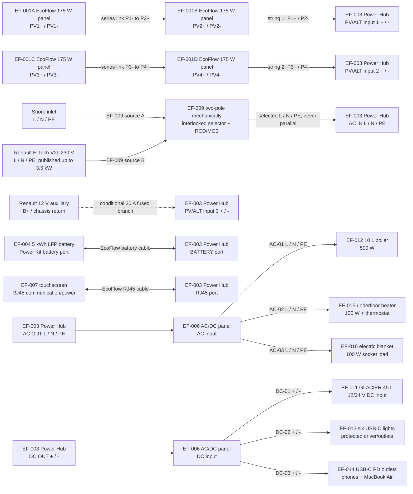

# SC-411-001 EcoFlow Minimal Electrical Alternative

## 1. Purpose and boundary

Define and calculate a minimal fixed EcoFlow Power Kits alternative for the Renault Master E-Tech camper. The design serves the requested refrigerator, water heating, lighting, personal-device charging, floor heat and blanket loads. It is a draft packaging and material-cost alternative, not procurement, installation, energization or vehicle-interface approval.

“All EcoFlow components” is applied to the available power-generation, storage, distribution, monitoring and refrigerator functions. EcoFlow does not offer the specified fixed 10 L boiler, installed USB-C lighting, underfloor heater, blanket, vehicle/shore changeover or all mandatory wiring/protection. Those functions necessarily use third-party material.

## 2. Proposed configuration

| Function | Component ID and candidate | Controlled quantity |
|---|---|---:|
| Roof generation | EF-001 EcoFlow 175 W rigid TOPCon panel | 4 |
| Integrated conversion | EF-003 EcoFlow Power Hub 5 kVA | 1 |
| Storage | EF-004 EcoFlow 5 kWh LFP battery | 1 |
| Branch distribution | EF-006 EcoFlow Smart AC/DC Distribution Panel | 1 |
| Local control | EF-007 EcoFlow Power Kits touchscreen | 1 |
| Refrigerator | EF-011 EcoFlow GLACIER Classic 45 L | 1 |
| AC source selection and protection | EF-009 two-pole interlocked shore/V2L interface | 1 |
| Conditional travel top-up | EF-018 protected 12 V input branch | 1 |

The controlled component and material-price register is [`ecoflow-core-bom.csv`](../../calculations/ecoflow-core-bom.csv). Prices are material only. Labour, engineering, testing, certification, delivery, price escalation and contingency are excluded.

## 3. Connection architecture

The diagram identifies functional terminals, not physical connector cavity numbers. Only the configuration-matched EcoFlow manuals and Renault body-builder instructions may define final connector pinouts, conductor sizes, fuse ratings, PE/bonding topology and permitted vehicle connection points.

## 4. Connection schedule

| Connection | From component and pin | To component and pin | Control |
|---|---|---|---|
| C-01 | EF-001A PV1- | EF-001B PV2+ | Locked PV series connector |
| C-02 | EF-001A PV1+ / EF-001B PV2- | EF-003 PV/ALT input 1 + / - | Independent 2S MPPT string |
| C-03 | EF-001C PV3- | EF-001D PV4+ | Locked PV series connector |
| C-04 | EF-001C PV3+ / EF-001D PV4- | EF-003 PV/ALT input 2 + / - | Independent 2S MPPT string |
| C-05 | Shore L / N / PE | EF-009 source A L / N / PE | Inlet and upstream protection |
| C-06 | Renault V2L L / N / PE | EF-009 source B L / N / PE | Vehicle option and operating evidence required |
| C-07 | EF-009 output L / N / PE | EF-003 AC IN L / N / PE | Two-pole interlock; no paralleling |
| C-08 | Renault auxiliary B+ / return | EF-003 PV/ALT input 3 + / - | Conditional; 20 A maximum; fuse at source |
| C-09 | EF-004 Power Kit battery port | EF-003 BATTERY port | EcoFlow battery cable and bracket |
| C-10 | EF-007 RJ45 | EF-003 RJ45 | EcoFlow communication/power cable |
| C-11 | EF-003 AC OUT L / N / PE | EF-006 AC input | EcoFlow cable/protection per manual |
| C-12 | EF-003 DC OUT + / - | EF-006 DC input | EcoFlow cable/protection per manual |
| C-13 | EF-006 DC-01 + / - | EF-011 DC input + / - | Protected refrigerator branch |
| C-14 | EF-006 DC-02 + / - | EF-013 driver/outlet + / - | Six-light protected branch |
| C-15 | EF-006 DC-03 + / - | EF-014 USB-C PD input + / - | Device-charging protected branch |
| C-16 | EF-006 AC-01 L / N / PE | EF-012 boiler L / N / PE | Dedicated protected branch |
| C-17 | EF-006 AC-02 L / N / PE | EF-015 thermostat/heater L / N / PE | Dedicated protected branch |
| C-18 | EF-006 AC-03 L / N / PE | EF-016 blanket socket L / N / PE | Protected socket circuit |

## 5. Energy and power result

The reproducible model in [`ecoflow_minimal_design.py`](../../calculations/ecoflow_minimal_design.py) produces:

| Result | Value |
|---|---:|
| Load-side energy | 1.730 kWh/day |
| Battery/source-side energy | 1.894 kWh/day |
| Arithmetic continuous load | 922 W |
| Arithmetic peak upper bound | 972 W |
| Margin to 4 kW continuous Power Hub rating | 3.028 kW |
| One-battery planning autonomy | 1.97 days |
| Exact two-day nominal battery requirement | 5.208 kWh |

The 5.12 kWh battery is 88 Wh, or approximately 1.7%, below the exact two-day nominal result. It is retained as the minimal configuration because the difference is smaller than the uncertainty in the estimated duty cycles; the controlled result remains 1.97 days, not two full planning days.

## 6. Solar design and failure behavior

Four 175 W panels provide 700 Wp and occupy an approximate 2352 × 1524 mm two-by-two envelope before gaps, supports and exclusion zones. A roof scan is still required.

The panels are not one four-panel series string. They form two separate 2S strings on independent MPPT inputs:

- shade or failure on one string reduces only that string; the other string can continue charging;
- each string still suffers series-string current limitation if either of its two modules is shaded;
- a shorted bypass diode, open connector, damaged cable or MPPT fault can disable its string;
- partial shade can move the operating point and reduce more power than the shaded area alone suggests;
- separate string isolation, accessible connectors, strain relief, UV protection and diagnostic current comparison are required.

At the 70% planning derate, the modeled seasonal yield is 2.450 kWh/day summer, 1.470 kWh/day shoulder and 0.735 kWh/day winter. Solar covers approximately 129%, 78% and 39% of the design day respectively. Solar-first therefore does not mean solar-only outside favorable summer conditions.

## 7. Charge-source policy

1. Solar is the primary automatic source through MPPT inputs 1 and 2.
2. Shore line is the normal secondary source.
3. Renault V2L 230 V is the backup AC source, manually selected only when shore is disconnected.
4. Renault 12 V is a conditional, slow travel top-up and not the backup source.

Shore and V2L share the single EcoFlow AC input through EF-009. A two-pole mechanically interlocked selector is mandatory so the two AC sources cannot be paralleled or back-fed. The initial EcoFlow AC input limit is 6 A, approximately 1.38 kW from the source and 1.242 kW into the battery at the planning efficiency. This replaces one design day in about 1.52 h and charges from the planning 20% floor to full in about 3.30 h.

Renault publishes 230 V V2L capability up to 3.5 kW for current Master E-Tech variants. The exact selected vehicle must still be ordered with the option and its socket rating, PE/earthing behavior, time limits, low-traction-state behavior and compatibility with the EcoFlow input must be verified. No direct high-voltage connection is permitted.

The optional 12 V branch is capped at 20 A in the model. At 13.8 V and 85% end-to-end efficiency it provides approximately 235 W and needs about 8.07 driving hours to replace one design day. It remains absent from a released installation until Renault approves the auxiliary connection point, continuous current, fuse, return path and wake/sleep behavior.

## 8. Material, mass and control totals

| Control total | Value |
|---|---:|
| Complete listed material estimate | CHF 12,089 |
| Complete listed material mass | 154.35 kg |
| Manufacturer-declared or current retail values | Mixed with identified allowances |
| Roof material mass | 47.20 kg |

These values are retained in the controlled BOM and generated calculation, so the whole-vehicle cost and mass registers can consume them. Estimated masses remain estimates until selected products, measured harnesses and mounting designs exist.

## 9. Release gates

- confirm exact Renault Master E-Tech configuration includes the required V2L option;
- obtain Renault body-builder approval for any 12 V auxiliary connection;
- verify EcoFlow manuals for every connector and protective-device detail;
- complete roof geometry, structure, aerodynamic, sealing and approval work;
- select certified boiler, lighting, heating, blanket and USB-C components;
- produce a measured cable schedule, protection-coordination study and PE/bonding design;
- confirm AC changeover, RCD/MCB and V2L earthing behavior with a qualified electrical designer;
- refresh material prices and manufacturer masses immediately before procurement;
- obtain Design Authority and applicable Swiss approval before installation or energization.
