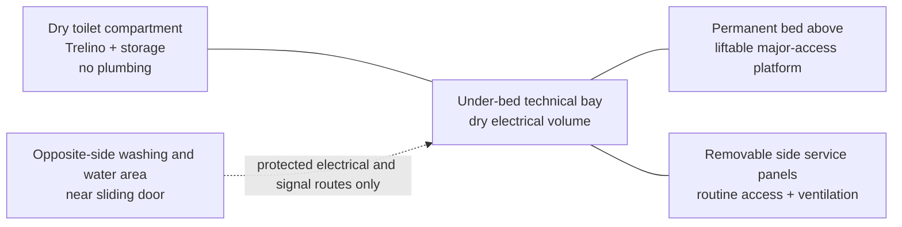

# SC-500-001 Mechanical Architecture

## 1. Purpose

Define the preliminary physical allocation and mechanical integration rules for the Renault Master E-Tech electric L2H2 conversion. This issue records the EM-002 allocations needed to develop the bed, dry toilet, washing/water area, and technical bay as one coherent layout.

## 2. Accepted spatial allocations

| Zone | Allocation | Current status |
|---|---|---|
| Permanent sleeping zone | Two independent permanent beds, each at least 1800 mm × 700 mm | Requirement accepted; detailed layout open |
| Dry toilet compartment | Trelino composting toilet and sanitary-item storage; no sink, shower, fresh-water plumbing, or grey-water plumbing | Accepted |
| Technical bay | Inside the van, under a permanent bed, adjacent to the dry toilet compartment | Accepted in ADR-004 |
| Washing and water-service area | Opposite side of the van near the sliding door; supports hand and dish washing and the fresh/grey-water functions | Accepted |
| Outside shower | Exterior-use function supplied from the water system | Requirement accepted; interface open |

The diagram describes relationships, not vehicle orientation or final dimensions.

## 3. Technical-bay mechanical integration

### 3.1 Bed platform

The bed platform is both habitation structure and major-service access. It must:

- support declared occupants, bedding, and dynamic service loads;
- open far enough to expose the complete heavy-module removal envelope;
- remain positively secured in the open position during service;
- prevent the mattress or bedding from entering electrical or ventilation clearances;
- transfer structural loads independently of removable decorative panels;
- permit inspection of equipment restraints and primary cable supports.

### 3.2 Side service panels

Side panels provide routine access without disturbing the bed. They must:

- be removable and refittable repeatedly with captive or controlled reusable fasteners;
- preserve furniture stiffness and rattle control;
- expose operator/service controls before hazardous sections;
- incorporate or retain clear paths to the low inlet and high outlet grilles;
- prevent stored items from blocking the grilles or striking technical equipment;
- carry labels identifying isolation state, stored-energy hazards, and service level.

### 3.3 Internal mounting

Power and control modules mount to removable equipment panels, rails, or brackets rather than directly to decorative furniture where practical. Mounts retain access to fasteners, connectors, cable bend radii, and module lifting grips. The battery and other heavy equipment use vehicle-appropriate structural restraint independent of cabinetry.

## 4. Environmental separation

The adjacent toilet compartment is dry and does not require a waterproof technical-bay bulkhead. It shall nevertheless remain a separate compartment for hygiene, odor control, storage control, and access management.

The washing and water-service zone is remote from the technical bay. No pipe, hose joint, pump, filter, fill fitting, or drain is routed within or above the bay. Necessary electrical and sensor routes cross through protected, labelled paths arranged against liquid tracking.

General cabin condensation, spilled drinks, cleaning water, exterior ingress, and remote plumbing faults remain credible environmental sources and are addressed in the risk register.

## 5. Ventilation integration

Passive ventilation uses a defined low inlet and high outlet communicating with the general living space. Grilles are concentrated rather than implemented as random perforation across an entire panel. This provides measurable net free area, preserves panel stiffness, simplifies cleaning, and allows an intentional convection route.

Mechanical provisions shall:

- separate inlet and outlet vertically and, where possible, horizontally;
- prevent mattress, bedding, luggage, or toilet storage from blocking airflow;
- allow grille and coarse-screen cleaning without exposing hazardous terminals;
- reserve a mounting and cable provision for a quiet temperature-controlled extraction fan;
- control fan vibration and structure-borne noise if the fan is later justified;
- allow temperature sensing at battery, power electronics, inlet, and outlet locations.

Final grille geometry and fan need are outputs of the SC-402 thermal analysis and test plan.

## 6. Access and human factors

| Maintenance task | Primary access | Design intent |
|---|---|---|
| View status, operate isolator, inspect protection | Side panel | No mattress movement |
| Connect diagnostics or take defined safe measurement | Side panel | Hazardous terminals remain guarded |
| Replace small field module | Side panel where envelope permits | No unrelated-module removal |
| Replace battery or large power module | Lifted bed platform | Positive support and documented lifting/removal route |
| Inspect structural restraints and main cable supports | Lifted bed platform | Full visual and tool access |
| Clean ventilation grilles | Exterior face of side panel | No technical-zone entry required |

The target 30-minute replacement principle remains an architectural objective, not a universal acceptance requirement until each field-replaceable module is classified and timed.

## 7. Mass and structural rules

- Record each item over 0.5 kg in the mass budget under NFR-028.
- Place the battery and heavy power equipment as low as the approved structure and access route allow.
- Calculate local floor, bracket, bed-frame, and restraint loads using applicable vehicle load cases.
- Check left/right and axle distribution using the exact vehicle configuration.
- Preserve an explicit mass and volume growth reserve.
- Do not drill, cut, or fasten into the vehicle until Renault/body-builder exclusion zones and approved methods are established.

### 7.1 Roof-solar integration

SC-410 carries four compact rigid 200 W modules as a two-by-two packaging rectangle of 2549 × 1553 mm before perimeter clearance. The fixed solar equipment is estimated at 61.24 kg and is contained within a 75 kg roof planning allocation.

The Design Authority supplied a 200 kg roof-load input. The applicable design limit is the lower of this value and the vehicle-specific allowance confirmed by Renault and the approval authority. The unused numerical margin is not permission to add equipment: roof geometry, local rib capacity, mounting distribution, dynamic and crash loads, aerodynamic uplift, fatigue, corrosion, watertight penetrations, shading, cleaning access and whole-vehicle payload remain independent constraints.

The mechanical roof design shall:

- measure the complete usable surface, ribs, seams, curvature and body-builder exclusions;
- preserve safe perimeter, hatch, cable-entry, antenna and service clearances;
- distribute loads through approved structural paths rather than unsupported roof skin;
- qualify rails, brackets, adhesive and fasteners for temperature, vibration, fatigue and uplift;
- support and protect all PV cable without water traps, abrasion or loose aerodynamic loops;
- use a controlled, inspectable and leak-tested cable entry;
- allow individual module replacement without destructive roof work where practical;
- record module, mounting, cable-entry and reserved roof mass separately.

## 8. Interfaces

| Interface | Mechanical content | Owner |
|---|---|---|
| IF-408 Technical bay to vehicle/body | Mounting, crash restraint, mass, bonding provision, cooling-air path | Physical Architecture |
| Bed platform to bay | Structural support, opening travel, positive stay, service clearance | Habitation / Physical Architecture |
| Side panel to bay | Routine access, reusable fasteners, guarding, grille integration | Habitation / Maintenance |
| Dry toilet to bay | Partition, odor/hygiene separation, no plumbing penetration | Habitation |
| Remote water area to bay | Protected cable/signal route; no liquid path | Water and Sanitary / Electrical Power |
| Roof PV to vehicle/body | Local structure, distributed attachment, uplift, fatigue, ingress, corrosion, cable entry and 75 kg planning allocation | Physical Architecture / Electrical Power / Compliance |

## 9. Verification concept

- Dimensioned measured-layout review using the selected vehicle.
- Static and applicable dynamic structural analysis.
- Bed-platform load, opening, positive-support, and obstruction tests.
- Side-panel removal/refit cycle and rattle inspection.
- Representative battery and module removal-path demonstration.
- Ventilation-obstruction inspection with normal bedding and storage installed.
- Mass, centre-of-mass, axle-load, and payload analysis followed by staged weighing.
- Traceability inspection linking labels and physical identifiers to documents.
- Roof measurement, attachment/uplift analysis, water-ingress test and staged roof/axle weighing.

## 10. Open actions

- Measure the selected Renault L2H2 under-bed envelope and all access paths.
- Produce a dimensioned habitation layout showing beds, aisle, dry toilet, sliding door, and water area.
- Define representative equipment and battery envelopes.
- Perform the SC-402 loss budget and passive-ventilation calculation.
- Develop structural restraint and bed-platform concepts.
- Decide panel material, reusable-fastener type, grille geometry, and acoustic treatment after calculations and mock-up testing.
- Obtain vehicle-specific evidence for the 200 kg roof input and complete the roof-solar mounting and aerodynamic analysis.
- Demonstrate that the 2549 × 1553 mm candidate array coexists with the final roof hatch, ventilation, cable-entry and service-clearance layout.

## 11. Traceability

- Requirements: [FR-001, FR-003, FR-004, NFR-027 through NFR-029, NFR-035, NFR-039, and proposed NFR-042](../10-requirements/SC-100-001-system-requirements.md)
- System architecture: [SC-200-001](SC-200-001-system-architecture.md)
- Technical bay: [SC-402-001](SC-402-001-technical-bay-preliminary-design.md)
- Electrical and solar design: [SC-410-001](SC-410-001-electrical-and-solar-preliminary-design.md)
- Decision: [ADR-004](../40-decisions/ADR-004-under-bed-technical-bay.md)
- Risks: [R-001, R-002, R-006, R-009, R-014, and R-015](../50-risk/SC-950-001-risk-register.md)
- Meeting: [EM-002](../60-design-reviews/EM-002-technical-bay-and-repository-governance.md)
